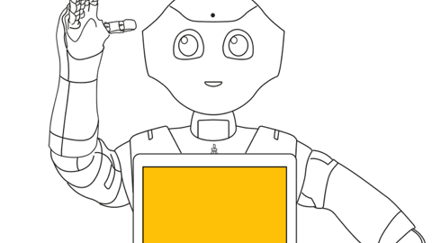
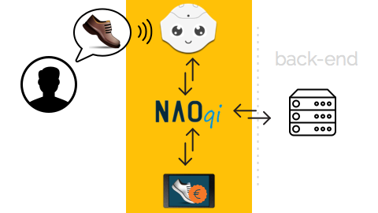
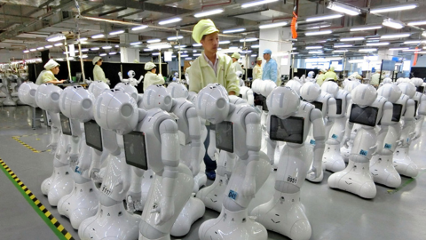

# Pepper ou la robotique du web

Dernièrement, vous avez peut-être entendu parler de [**Pepper**](https://www.aldebaran.com/fr/qui-est-pepper), le dernier robot humanoïde conçu par l'entreprise [Aldebaran](https://www.aldebaran.com/fr).

Contrairement à son petit frère [Nao](https://www.aldebaran.com/fr/qui-est-nao), celui-ci dispose d'une tablette (positionnée sur son torse) qui lui permet d'enrichir l'expérience auprès des utilisateurs. Soit en affichant des contenus multimédias, soit en offrant de nouvelles possibilités d'interaction.

On retrouve ainsi les fonctionnalités classiques d'une **tablette** qui tire parti du **Web**, mais qui sont mises à disposition par un **robot humanoïde**.

Robot humanoïde / Web / tablette, c'est quoi le rapport entre tout ça ? Et en quoi cela peut-il changer nos usages ?

## Pepper, c'est quoi ? C'est qui ?

Pepper est un robot humanoïde qui a pour vocation d'être un réel compagnon interactif plutôt qu'un simple robot effectuant des tâches répétitives.

Pour être à la hauteur de ces espérances, il dispose de nombreux atouts :

* Une **présence physique indéniable** : robot d'1m20 pour 28kg, disposant de 17 articulations, 3 roues omnidirectionnelles (vitesse 3km/h).
* Une **connexion réseau Internet** (wifi/ethernet).
* Une **armada de capteurs** pour mieux appréhender son environnement : 3 caméras (dont une 3D), 2 émetteurs et récepteurs sonars, 6 capteurs lasers et 3 détecteurs d'obstacle ainsi que des capteurs tactiles sur ses mains.
* Une **reconnaissance vocale poussée** : 4 microphones directionnels couplés à un système distant de traitement du signal audio.
* Une **tablette tactile** pour proposer des contenus multi-médias et disposer d'un système d'interactions traditionnels.

Ce qui nous intéresse plus particulièrement chez [Webyousoon](http://www.webyousoon.com), c'est bien évidemment le dernier point, sa tablette tactile.

Pour autant cette tablette n'a pas plus d'intérêt que les autres si celle-ci n'est pas associée aux autres facultés de Pepper.

## Savoir combiner les facultés du robot

Prenons l'exemple où Pepper doit conseiller des clients dans un rayon sur une typologie d'articles.

À première vue, il pourrait s'agir d'une application mobile (de présentation des articles) connectée à un _back-end_. L'application s'utilise directement sur Pepper ; offrant ainsi une expérience enrichie du fait du support amovible autonome.

C'est déjà mieux, mais cela reste très limité, car **pour obtenir la meilleure expérience possible**, le robot doit être en mesure :

* De présenter des produits de manière orale, gestuelle et visuelle.
* De comprendre les signaux oraux et corporels des clients.
* D'interroger des bases de données pour apporter des réponses adéquates.

Surtout il doit **être capable de faire tout cela de manière orchestrée**. Or le seul orchestrateur pouvant à la fois animer le robot, afficher les contenus sur la tablette, détecter les interactions des clients et interroger le back-end, c'est **le robot lui même et plus particulièrement son OS : [NAOqi OS](https://www.aldebaran.com/fr/solution-robotique/logiciel-robot/nao)**.

Ainsi **contrairement à une application mobile classique, ce n'est pas elle qui pilote son comportement**, elle ne fait que souscrire à des événements et remonter d'autres événements. C'est un cas typique de [programmation événementielle](https://fr.wikipedia.org/wiki/Programmation_%C3%A9v%C3%A9nementielle).

Les [_QIMessaging services_](http://doc.aldebaran.com/2-1/dev/js/index.html#) fournis par Aldebaran permettent d'établir une communication par messages directement entre un robot (disposant de NAOqi) et un navigateur web en JavaScript.

La communication étant établie, il devient alors tout à fait possible de construire une **application web standard (HTML5 / CSS3 / JavaScript) tournant sur la tablette et se faisant piloter par des événements émis par le robot**.

On obtient alors une expérience bien plus enrichissante et interactive.

## Pepper, bientôt partout ?

Il existe plusieurs raisons laissant à penser que la tendance Pepper va percer en France et s'installer durablement :

* Il existe un **engouement certain pour Pepper**, pour information la vente au grand public au Japon de 1000 Peppers a été réalisée en une minute seulement !
* On parle régulièrement des révolutions de l'IoT (_Internet of Things_) et de la robotique. Force est de constater que Pepper est aujourd'hui le seul **objet autonome** accessible au grand public disposant de tant de capteurs.
* Dernière raison, et non des moindres, les usines dédiées se sont considérablement agrandies et modernisées et laissent entrevoir une **production de masse**.

La vente de Pepper au grand public français n'a pas encore été officialisée, mais cela devrait être la suite logique des choses au vu du déploiement qui s'est opéré au Japon.

Que ce soit dans un contexte personnel, où il est possible d'installer de nouvelles applications via une [plateforme dédiée](https://store.aldebaran.com/eur_en/applications.html), ou dans un contexte professionnel, pour proposer des fonctionnalités spécifiques à son activité ; cela laisse entrevoir de **nouveaux usages qui vont révolutionner notre quotidien**.

Pour que cela soit le cas, il faudra **concevoir ces nouveaux usages avec les pleines facultés de Pepper** et **repenser nos mécanismes de programmation IHM**.
