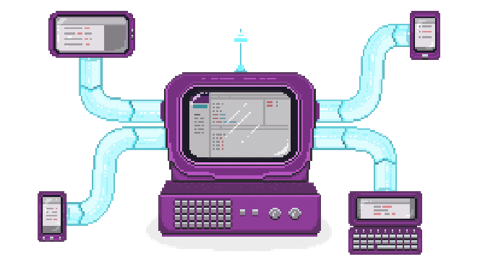
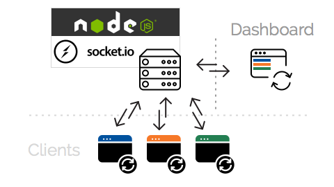
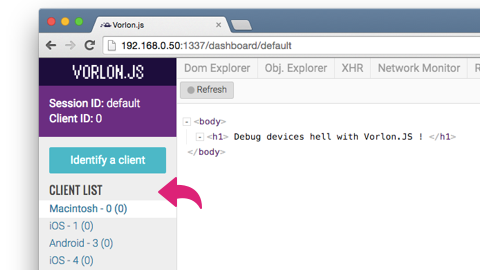
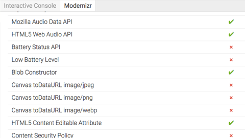
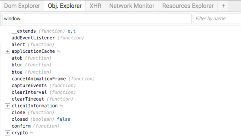

# Présentation Vorlon.JS

[Vorlon.JS](http://vorlonjs.com/) est un outil développé par les équipes Microsoft, qui doit faciliter le _debug_ d'applications web (notamment sur le JavaScript) à distance, c'est-à-dire lorsque les dites applications sont directement exécutées sur des _devices_ (aka _smartphones_, tablettes).

On peut se poser la question de son intérêt quand on connait déjà les outils existants présents dans les navigateurs.

Dans cet article, voyons quel est son fonctionnement pour découvrir sa plus-value et ses limites.

## Revue des forces en présence

Si vous réalisez des applications web, vous utilisez sûrement déjà les outils présents dans les navigateurs à destination des développeurs :

* [Developer Tools](https://developer.mozilla.org/en-US/docs/Tools) dans [Firefox Developer Edition](https://www.mozilla.org/fr/firefox/developer/)
* [Chrome DevTools](https://developers.google.com/web/tools/chrome-devtools/) dans [Chrome](http://www.google.com/chrome)
* [F12 Dev Tools](https://dev.modern.ie/platform/documentation/f12-devtools-guide/) dans [Microsoft Edge](https://www.microsoft.com/fr-fr/windows/microsoft-edge)
* [Web Development Tools](https://developer.apple.com/safari/tools/) dans [Safari](http://www.apple.com/fr/safari/)
* [Opera Dragonfly](http://www.opera.com/dragonfly/) dans [Opera](http://www.opera.com/fr)

Pour ne citer que les principaux.

En général, lorsque vous développez, vous utilisez le navigateur qui a les outils qui répondent à vos besoins et avec lequels vous êtes le plus à l'aise. Parfois, vous en utilisez plusieurs car certaines fonctionnalités ne sont pas présentes partout.

De manière régulière, vous allez également sur d'autres navigateurs, histoire de faire un test de confiance pour vous assurer de la compatibilité de ce que vous avez développé.

## Univers des _devices_

Puis vient le temps de la qualification, vous êtes consciencieux, vous avez automatisé des tests avec des _headless browsers_ (navigateurs sans têtes), et vous avez même ciblé un parc de _devices_ sur lesquels vous réaliserez des tests réels.

C'est bien, cela vous permettra de couvrir un pourcentage significatif d'utilisateurs ; mais pour **une couverture 100% avec toutes les particularités techniques des _devices_ présents sur le marché, oubliez c'est une chimère**.

Donc potentiellement vous allez recevoir des anomalies en production qui se sont produites sur des _devices_ hétérogènes à votre parc.

Si vous arrivez à reproduire une anomalie sans le _device_ mentionné, vous devriez vous en sortir. Là où c'est plus problématique c'est lorsque ce n'est pas le cas.

Vous devez vous procurer le _device_ en question pour le connecter via un **cable USB et installer les pré-requis nécessaires aux outils de _remote debug_**, ce qui peut être plus ou moins compliqué selon le couple OS/navigateur du _device_ à tester et votre propre OS de développement.

Bref, **la démarche est longue, fastidieuse et chère** ; principalement dû au fait des inter-dépendances natives multiples entre OS et navigateurs.

C'est sur cette problématique qu'est née l'idée d'avoir un outil pragmatique, indépendant de solutions natives pour y palier (cf. [la démarche de Microsoft](http://blogs.msdn.com/b/eternalcoding/archive/2015/04/30/why-we-made-vorlon-js-and-how-to-use-it-to-debug-your-javascript-remotely.aspx)).

## Fonctionnement Vorlon.JS

Pour interagir avec un navigateur tout en s'assurant d'être indépendant aux solutions natives de celui-ci, il n'y a pas énormément de choix, il faut utiliser **JavaScript et l'injection de scripts à chaud**.

Pour effectuer cela, [Vorlon.JS](http://vorlonjs.com/) s'appuie sur [Node.js](https://nodejs.org/en/) et une de ses librairies [Socket.IO](http://socket.io/). Cela lui permet de faire office de serveur et d'interagir en temps réel avec tous les souscripteurs qui ont besoin d'une petite introspection.

Pour être souscripteur, rien de plus simple, vous allez d'abord injecter un script (qui va pointer sur le serveur en question) dans l'application web que vous souhaitez tester, c'est un peu le script "cheval de Troie".

Ensuite chaque navigateur exécutant cette application web (en ouvrant l'URL appropriée) va souscrire au serveur et une communication sera établie.

Communication qui permettra l'injection de scripts de façon dynamique.

Le serveur Vorlon.JS disposant d'un dashboard (une IHM web), on va déjà pouvoir lister tous les clients (combo _device_/navigateur) qui ont souscrits.

Ainsi dans mon exemple, on voit dans le dashboard que 4 clients ont souscrit à ma page :

* Mon desktop (Mac) avec Chrome
* Mon smartphone (iOS) avec Safari
* Ma tablette (Android) avec Chrome
* Mon smartphone (iOS), **toujours le même**, mais avec Chrome cette fois

En sélectionnant un client, on accède aux outils directement à distance. Ils sont disponibles dans 2 fenêtres à onglets.

* **Interactive console** : pour exécuter directement du JavaScript
* **Modernizr** : pour afficher les possibilités du navigateur, possibilités détecter via [Modernizr](https://modernizr.com/)

* **DOM Explorer** : pour afficher le DOM et éventuellement le modifier
* **Obj. Explorer** : pour afficher le scope global JavaScript du navigateur
* **XHR** : pour monitorer les appels XHR (les requêtes asynchrones Ajax)
* **Network Monitor** : pour afficher les ressources chargées par la page, avec leurs temps de chargement et la séquence de chargement
* **Resources Explorer** : pour afficher les données persistées localement dans le navigateur (local storage, session storage et cookies)

Ces fonctionnalités sont possibles via les plugins proposés par défaut dans Vorlon.JS, mais ce qui est intéressant c'est qu'il est possible d'[ajouter des plugins supplémentaires](http://vorlonjs.com/plugins/) selon votre besoin.

De manière générale, Vorlon.JS est **simple à mettre en place** (cf. [_Get started_](http://vorlonjs.com/#getting-started)) et son approche d'**injection de scripts à chaud associée à une IHM web permet de disposer des fonctionnalités instantanément**.

Bien évidemment, il y a le revers de la médaille.

Tout d'abord **l'injection de scripts a de sérieuses limites puisqu'elle vous oblige à travailler dans un contexte restreint du navigateur** (_viewport sandbox_) pour des raisons de sécurité. Vous ne pourrez donc jamais disposer de toutes les fonctionnalités avancées avec cette approche.

Ensuite, le fait d'interagir avec une IHM web et de communiquer par le réseau ne vous offrira **jamais le même confort et la même réactivité que les outils traditionnels**.

## Quels sont les cas d'utilisation ?

Soyons clair, **pour le développement et le debug "classique", Vorlon.JS n'apporte absolument rien de nouveau** et il est même bien moins performant que les outils présents dans les navigateurs. Si c'est uniquement votre besoin, passez votre chemin.

Pour le debug "distant", là ça va dépendre de vos besoins et de vos possibilités.

Si vous êtes en mesure de vous câbler avec le device à tester **ET** que votre OS est compatible avec les outils de _remote debug_ que vous souhaitez utiliser. Là non plus, ça n'a pas grand intérêt.

Par contre, **si vous n'êtes pas en mesure de vous câbler avec le device à tester, là ça peut devenir vraiment intéressant**.

Ce cas est plus fréquent qu'on ne le pense :

* Un utilisateur/client vous appelle pour un problème sur un device bien précis et vous ne possédez pas ce device (il faut savoir rester pragmatique sur son parc de devices)
* Il n'est tout simplement pas possible de se connecter en USB au device (une tablette encastrée dans un appareil domotique par exemple)

Vous pourrez **rapidement disposer d'un premier diagnostique** via Vorlon.JS et ainsi vous faciliter la reproduction et la correction d'une anomalie.

En résumé je dirai que Vorlon.JS est un **outil complémentaire** qui va apporter de la valeur dans des **contextes de reproduction d'anomalies distants hostiles**. Contextes qui vont être de plus en plus fréquents lorsqu'on pense aux objets connectés qui vont arriver sur le marché.
